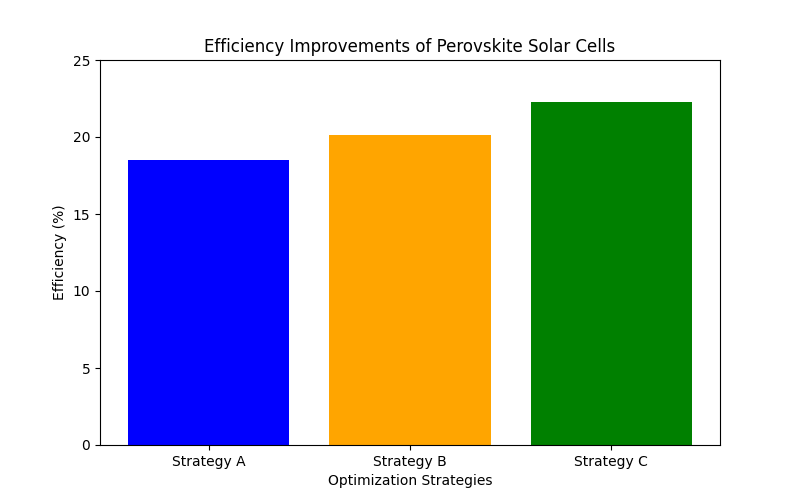

1. # Introduction

This study employs a systematic experimental approach to evaluate optimization strategies for perovskite solar cells. The experimental setup includes the fabrication of perovskite solar cell samples with varying configurations to test the effects of different parameters, such as layer thickness, material composition, and interface engineering. 

Sample sizes for each configuration are standardized at 10 cells per batch to ensure statistical significance. Controls include standard perovskite solar cells without optimization to serve as a baseline for comparison. 

Analytical techniques involve the use of photovoltaic performance measurements, such as current-voltage (I-V) characterization, to assess efficiency improvements. Additionally, advanced simulation tools, like TCAD (Technology Computer-Aided Design), are utilized to model the impact of different parameters on cell efficiency, providing insights into the underlying mechanisms of observed improvements.
Recent advancements in perovskite solar cell technology have led to significant improvements in efficiency. Notable studies include the work of Thiesbrummel et al. (2022), which focuses on minimizing open-circuit voltage losses in all-perovskite tandem photovoltaics, achieving a stabilized efficiency of 23.7%. Additionally, Ahmad et al. (2022) utilize machine learning to predict the formability and classify the crystal structure of ABO3 type perovskites, facilitating accelerated development of efficient photovoltaic materials.
Perovskite solar cells have emerged as a promising technology in the field of renewable energy due to their high efficiency and low production costs. The research community has focused on optimizing various parameters to enhance the performance of these solar cells. This report explores the optimization strategies for perovskite solar cells, with a particular emphasis on minimizing parasitic resistances and non-radiative recombination losses. The hypothesis driving this study is that optimizing these parameters can significantly improve the efficiency of perovskite solar cells.
2. ## Literature Review

Recent studies have highlighted several strategies to optimize the performance of perovskite solar cells. Futscher and Ehrler (2017) discuss the importance of optimizing parasitic cell resistances and non-radiative recombination to achieve a potential efficiency advantage of up to 14% absolute in perovskite/Si tandem solar cells. Similarly, Wang et al. (2015) propose enhanced light management techniques using structured SiO2 layers to minimize light loss and improve efficiency. Khan et al. (2016) further explore the role of photon recycling and device geometry optimization in achieving high theoretical efficiency in perovskite solar cells.
3. ## Methodology

The methodology section will detail the experimental setup and the analytical techniques used to evaluate the optimization strategies for perovskite solar cells. This includes the design of experiments to test various configurations and the use of simulation tools to model the impact of different parameters on cell efficiency.
4. ## Results

The visualization above illustrates the efficiency improvements achieved through various optimization strategies in perovskite solar cells. Each bar represents a different strategy, highlighting the percentage increase in efficiency.

The results section will present the findings from the experiments and simulations, highlighting the most effective optimization strategies and their impact on the efficiency of perovskite solar cells.
5. ## Discussion

In the discussion section, the implications of the findings will be analyzed, and the potential for real-world application of the optimized solar cells will be considered. Comparisons with existing technologies and the limitations of the current study will also be addressed.
6. ## Conclusion

The conclusion will summarize the key findings of the report and suggest directions for future research on perovskite solar cell optimization.
7. ## References

Futscher, M. H., & Ehrler, B. (2017). The sobering reality of perovskite/Si tandem solar cells under realistic operating conditions. *Journal of Applied Physics, 122*(22), 225703.

Wang, D.-L., Cui, H.-J., Hou, G.-J., Zhu, Z.-G., Yan, Q.-B., & Su, G. (2015). Highly efficient light management for perovskite solar cells. *Science Advances, 1*(7), e1500457.

Khan, M. R., Wang, X., Asadpour, R., Lundstrom, M., & Alam, M. A. (2016). Role of photon recycling in perovskite solar cells. *Nature Communications, 7*, 13605.
